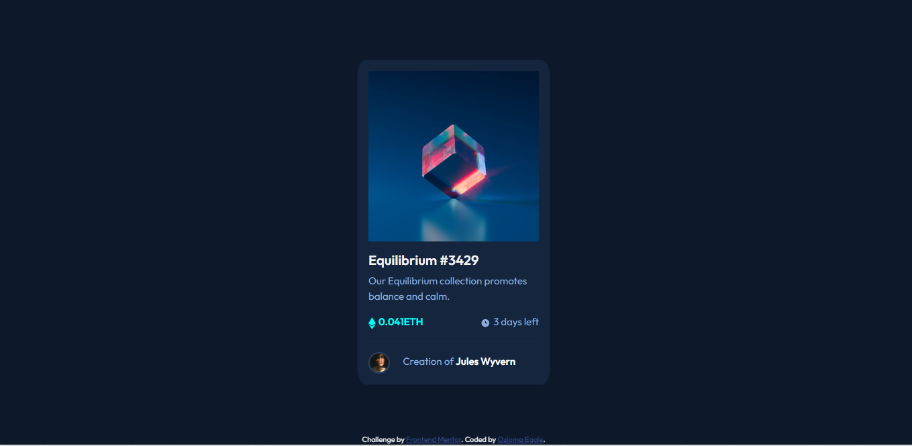
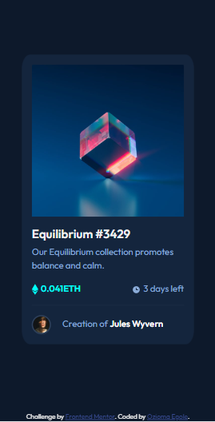

# Frontend Mentor - NFT preview card component solution

This is a solution to the [NFT preview card component challenge on Frontend Mentor](https://www.frontendmentor.io/challenges/nft-preview-card-component-SbdUL_w0U). Frontend Mentor challenges help you improve your coding skills by building realistic projects. 

## Table of contents

- [Overview](#overview)
  - [The challenge](#the-challenge)
  - [Screenshot](#screenshot)
  - [Links](#links)
- [My process](#my-process)
  - [Built with](#built-with)
  - [What I learned](#what-i-learned)
  - [Continued development](#continued-development)
  - [Useful resources](#useful-resources)
- [Author](#author)
- [Acknowledgments](#acknowledgments)

## Overview

### The challenge

Users should be able to:

- View the optimal layout depending on their device's screen size
- See hover states for interactive elements

### Screenshot

### Links

- Solution URL:(https://github.com/Ozioma45/Frontendmentor_challenges/tree/main/nft-preview-card-component-main)
- Live Site URL:(https://ozioma45.github.io/Frontendmentor_challenges/nft-preview-card-component-main/)

## My process

### Built with

- Semantic HTML5 markup
- CSS custom properties
- Flexbox
- CSS Grid
- Mobile-first workflow
- [Bootstrap](https://https://getbootstrap.com/docs/5.0/getting-started/introduction//) - Css Framework

### What I learned

I really love these challenge and i am glad i get to try out new stuffs and build myself in bootstrap

### Continued development

Bootstrap is really an interest tool and think i will try it more in future my project.

## Author

- Frontend Mentor - [@Ozioma45](https://www.frontendmentor.io/profile/Ozioma45)
- Twitter - [@EgoleOzioma](https://www.twitter.com/EgoleOzioma)
- Instagram - [gospel_egole](https://www.instagram.com/gospel_egole)
